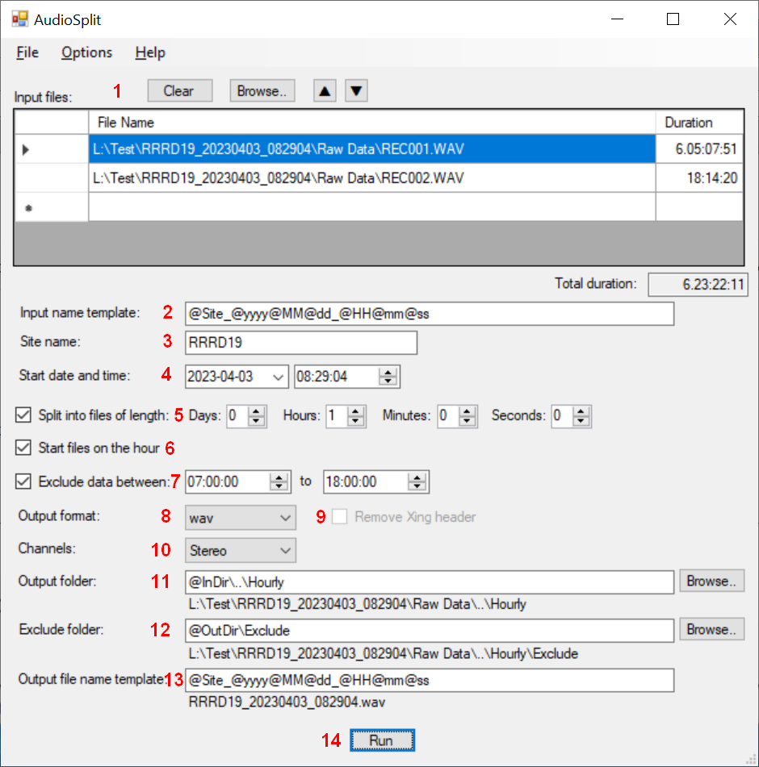

[AudioSplit](https://github.com/dmcclimans/AudioSplit)
==========

AudioSplit is a Windows application that can combine audio files and split the resulting
output file into segments with a specified duration. It provides a flexible naming system
for the output files.

AudioSplit was developed for use by the USA National Park Service and National Forest Service
to process long audio files of wildlife sounds (such as birds and toads) captured by wildlife
recorders.

## Contents
* [Features](#features)
* [Requirements](#requirements)
* [Installation](#installation)
* [Main Form](#MainForm)
* [Options](#options)
* [Templates](#templates)
* [Known Issues](#KnownIssues)
* [License](#license)

## Features
* Combine one or more audio files of various types into one stream.
* Split audio files into segments of a specified length.
* Name the output files based on a file name template that can be either date and
time based or sequentially numbered.
* Optionally exclude sounds recorded during specified hours of the day.
Excluded files are not deleted, but are moved to an Exclude folder.

## Requirements
* Requires Windows 10 or later.
* Requires the 64-bit version of Windows.

## Installation
* Go to the AudioSplit
  [latest release](https://github.com/dmcclimans/AudioSplit/releases/latest)
  page and download `AudioSplit_x.y.zip` (where x.y is the version number).

* There is no install program.
  Unzip the files into a folder, and run `AudioSplit.exe`.

## Main Form

1.  The **Input files** table contains the list of files to be processed.
    Use the **Browse** button to select the input files, or manually enter the path and
    file name.

    In the Open Files dialog you can select multiple files by holding down the ctrl or shift key
    while you click with the mouse. Use ctrl+A to select all files in a folder.

    Files are processed in the order listed.
    Use the **up** and **down** arrow buttons to change the order of the files for processing.

2.  If you specify an **Input name template**, the system will attempt to analyze the file
name and folder names of the first file in the **Input files** list. It can extract the
site name, date, and time from the file or folder name.
See the [Templates](#templates) section below for details.

3. The **Site name** field can be used to name the output files and/or folders.
This field can be automatically populated using the **Input name template**.
See the [Templates](#templates) section below for details.

4. Set the **Start date and time** of the first file. This will be used to name the output
files. This field can be automatically populated using the **Input name template**.

5. Check the **Split into files of length** checkbox to split the combined input files
into output files (segments) with the specified length.

6. Check the **Start files on the hour** checkbox to start files on the hour. You should
set the split length to be 1 or more hours, with zero for the minutes and seconds. The first
file will be a "catch-up" file of length less than an hour, and subsequent files will
start on the hour.

6. Check the **Exclude data between** checkbox to specify that certain files are to be
excluded.
Specify a time range for each day to exclude.

    Output files that fall completely within this time range will be moved to the Exclude
    folder (they are *not* deleted).

    The exclude time can be during the day (such as 7 am to 7 pm -- 0700 to 1900) or overnight
    (such as 7 pm to 7 am -- 1900 to 0700).

8. Set the **Output format** to the type of output file desired. You can produce WAV, FLAC,
MP3, or AIF files.

    AudioSplit always decodes the input files and re-encodes the output files, even if the
    input and output formats are the same. This may produce a small loss of audio quality if
    you are re-encoding a compressed format such as mp3, but it is necessary in order to get
    accurate times for the recordings.

9. If the **Remove Xing header** option is checked, mp3 files will be written without an
Xing header frame. This option only applies to mp3 files and is normally off.
Check this option if you are performing further processing with a program that cannot
process the Xing header.

10. If you are processing stereo files, set **Channels** to "Stereo" to process both
channels, or select "Left" or "Right" to extract only one channel of the audio.

11. Specify the **Output** folder.
You can use template variables in the path and folder name.
See the [Templates](#templates) section below for details.

    This folder will be created if it does not already exist. If it does exist, it must be
    empty.

12. Specify the **Exclude** folder. This is the folder where any files completely within
the exclude times will be placed.
You can use template variables in the path and folder name.
See the [Templates](#templates) section below for details.

    This folder will be created if it does not already exist. If it does exist, it must be
    empty.

13. The **File name template** is used to name the output files.
You can use template variables in the path and folder name.
See the [Templates](#templates) section below for details.

14. Click the **Run** button to begin processing.

## Templates

**Variables in Output folders and file names**

AudioSplit uses templates to define the generated folder and file names.

You can use these symbols in the output folder, exclude folder, and file name templates:

|Symbol     |Meaning                                        |
|-----------|-----------------------------------------------|
|@Site      |Site name                                      |
|@yyyy      |4 digit year                                   |
|@yy        |2 digit year                                   |
|@MM        |Month                                          |
|@dd        |Day of month                                   |
|@HH        |Hour (24 hour format)                          |
|@hh        |Hour (12 hour format)                          |
|@mm        |Minutes                                        |
|@ss        |Seconds                                        |
|@tt        |AM/PM indicator                                |

Example 1:

    @Site_@yyyy@MM@dd_@HH@mm@ss

will produce a set of filenames like this:

    RRRD19_20230403_082904.wav
    RRRD19_20230403_090000.wav
    RRRD19_20230403_100000.wav

For the **Output file name template**, you can use symbols that create a sequential file
number.

|Symbol     |Meaning                                        |
|-----------|-----------------------------------------------|
|@0         |Sequential file number starting with 0         |
|@00        |2 digit sequential file number starting with 0 |
|@000       |3 digit sequential file number starting with 0 |
|@1         |Sequential file number starting with 1         |
|@01        |2 digit sequential file number starting with 1 |
|@001       |3 digit sequential file number starting with 1 |

You can include additional leading zeros to force the numbers to have additional digits.

Example 2:

	@Site_@001

will produce a set of filenames like this:

    RRRD19_001.mp3
    RRRD19_002.mp3
    RRRD19_003.mp3

For the Output and Exclude folder names, you can use the @InDir symbol, and for the
Exclude folder you can also use the @OutDir symbol

|Symbol     |Meaning                                        |
|-----------|-----------------------------------------------|
|@InDir     |The folder of the first file in Input Files    |
|@OutDir    |The output folder                              |

Example 3:

    @InDir\..\Hourly

will use a folder named Hourly that is a sibling folder to the input folder.

Example 4:

    @OutDir\Exclude

will use a folder named Exclude underneath the Output folder.

**Variables in Input name template**

AudioSplit also uses templates to extract information from the input file name, or one of
its parent folder names. The **Input Name Template** can use @Site or any of the date and
time symbols. The system will attempt to match this to the name of the first file in the
**Input Files** list. If it does not match the file name, the system will try the name of
the folder that contains the first input file, then the parent folder, grandparent folder,
etc.

If a match is found, the variables will be used to populate the Site Name and Start Date
and Time fields in the Main form.

If you use a standardized format for your file or folder names, this allows you to process
different sites with different start date/times without changes to your configuration.
When you select the file to process, the system automatically picks up the site name and
start date/time, and then can use those variables to set the output folder and file names.

## Options

The menu has an **Options** item that allows you to control some aspects of the main form.

1.  When **Show date as yyyy-mm-dd** is checked, the system will display the start date in
international format, with the year first, then the month, and then the day.  If this
option is not checked, dates will display in the default format of your version of
Windows.

    This option does not affect templates. It only affects the Start Date display.

2. When **Show time in 24 hour format** is checked, the system will display times in
24-hour format. If this option is not checked, times will display in the default format of
your version of Windows.

    This option does not affect templates. It only affects the Start time and Exclude
    times.

3. When **Write log file** is checked, the system will save a log file in the
output folder. The log file contains messages produced by the audio processing program
(ffmpeg) while processing the files.

    You normally will not need to enable the log file, but it may be useful if there are
    problems processing the recordings.

## Known Issues

**Settings file moved in version 2.0**

In version 2.0 the file that contains the application settings was renamed and moved.
If you upgrade from an earlier version you will lose your settings.

To avoid losing you settings you can manually move your settings file. In versions
before 2.0 the settings file was named ``AudioSplitSettings.xml`` and was
located in the same folder as the exe file. To use this file with version 2.0 or
later, rename the file to ``Settings.xml``, and move or copy it to
``C:\Users\<username>\AppData\Roaming\AudioSplit\``.

## License
AudioSplit is licensed under the MIT license. You may use the AudioSplit application in
any way you like. You may copy, distribute and modify the AudioSplit software provided you
include the copyright notice and license in all copies of the software.

AudioSplit links to libraries that are also licensed under the MIT license.

AudioSplit uses, but does not link to, the program [ffmpeg.exe](https://ffmpeg.org/).
FFmpeg is licensed under the GNU General Public License (GPL) version 3. You may use the
software in any way you like. You may copy, distribute and modify the FFmpeg software as
long as you make the source code available.

See the [License.txt](License.txt) file for additional information.

